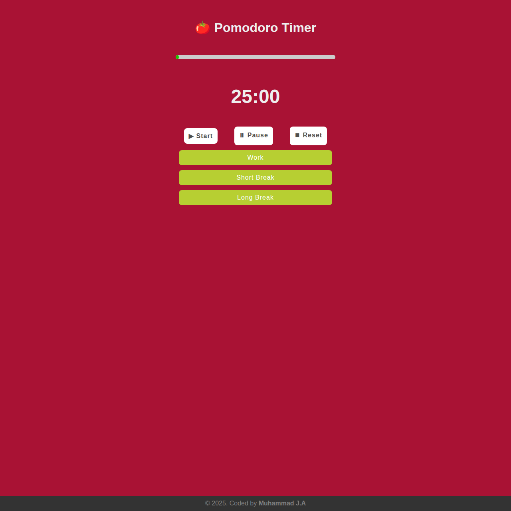

# 🍅 Pomodoro Timer

A simple yet effective **Pomodoro Timer** built using **HTML**, **CSS**, and **JavaScript** to help you boost productivity through focused work and structured breaks.



---

## 🚀 Live Demo
🔗 [View Project on Github Pages](https://muhammad-devel.github.io/pomodoro-timer/)

---

## 🧠 About the Project
This project implements the **Pomodoro Technique** — a time management method that alternates work sessions with short and long breaks.  
The app allows users to:
- Start, pause, and reset timers  
- Switch between **Work**, **Short Break**, and **Long Break** modes  
- Visually track progress through an animated line  
- Keep a simple record of completed Pomodoros  

---

## ⚙️ Features
✅ Start / Pause / Reset Controls  
✅ 3 Modes: Work, Short Break, Long Break  
✅ Animated progress line with canvas  
✅ Responsive design (mobile-friendly)  
✅ Session tracking (Pomodoro count)

---

## 🧩 Technologies Used

| Technology | Purpose |
|-------------|----------|
| **HTML5** | Structure and semantic layout |
| **CSS3** | Styling and responsive design |
| **JavaScript (ES6)** | Timer logic, DOM control, and animations |
| **Canvas API** | Drawing animated progress line |
| **GitHub Pages** | Deployment |

---

## 🕒 Pomodoro Logic

| Mode | Duration |
|------|-----------|
| 🧑‍💻 Work Time | 25 minutes |
| ☕ Short Break | 5 minutes |
| 🌴 Long Break | 15 minutes |

After each work session, a short break is started.  
After completing 4 Pomodoros, a long break is triggered automatically.

---

## 📂 Project Structure
pomodoro-timer/
│
├── index.html
├── style/
│ └── style.css
├── scripts/
│ └── index.js
├── pomodoro-screen.png
└── README.md


---

## 📸 Preview
You can include your app screenshot here:  
*(Example placeholder — replace with your own)*  
```html

🧑‍💻 How to Run Locally
# Clone the repository
git clone https://github.com/muhammad-devel/pomodoro-timer.git

# Open the folder
cd pomodoro-timer

# Open in browser
start index.html

💡 Future Improvements

Add notification sounds

Add task management

Store Pomodoro history in localStorage

Add statistics dashboard

🧑‍🎨 Author

👤 Muhammad J.A
💼 Frontend Developer (HTML, CSS, JS, React)
📧 [E-mail](jumaboyev2104@gmail.com)
🌐 [Your Portfolio Website or LinkedIn](https://muhammadjon-dev.vercel.app/)
